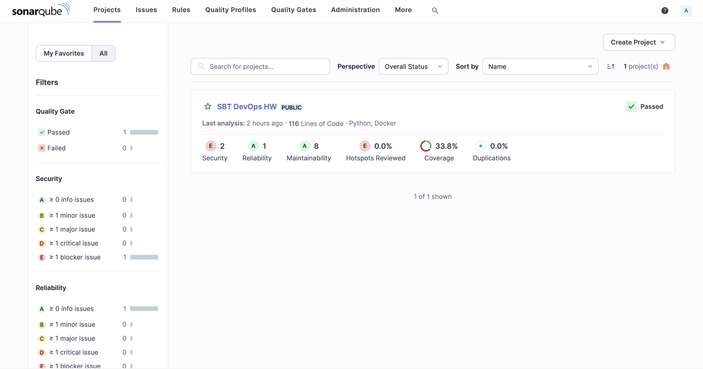

# 🌳 Laboratories of "Workshop on design and development of information systems"
## MIPT x SberTech
### Laboratory 1
🍄 **Task**: Нужно написать shell файл:
Который принимает на вход три параметра START|STOP|STATUS.
START запускает его в фоне и выдает PID процесса,
STATUS выдает состояние - запущен/нет,
STOP - останавливает PID
Сам shell мониторит утилизацию дискового пространства, количество свободных inode. 
Выводит информацию в виде csv файла. Имя файла должно содержать timestamp запуска +
дату за которую мониторинг. Предусмотреть создание нового файла при переходе через сутки

🍄 **Solution**: src -> script.sh

🍄 **Description:** для запуска

```bash 
    sh script.sh START / STOP / STATUS
```

команда START создает два файла: `monitor.pid` и `monitor_{timestamp}.csv`, частота мониторинга 60 секунд. Команда STOP заканчивает мониторинг и удаляет созданные файлы.

### Laboratory 4
🍄 **Task**: Взять приложение, автоматизировать его сборку в Jenkins (pipeline и freestyle Job) на событие pull-request/push.
В pipeline должны входить:
- сборка приложения (maven, другой сборщик)
- запуск автотестов (unit в зависимости от проекта, postman)
- сборка результатов работы тестов в allure и отброска в Jenkins
- анализ исходного кода Sonar (в том числе необходимо исправить все ошибки и (добиться не менее 90% покрытия кода тестами)* зависит от проекта)
- деплой приложения через Ansible (из лаб №2) или сборка контейнера (т.е. отказ от ансибл)

🍄 **Solution**: docker-compose с sonarqube и jenkins, приложение на питоне, юнит тесты и пр. 

🍄 **Description:** 

#### Docker
Поднять Jenkins и SonarQube
```bash 
  docker-compose up -d --build
```
#### App
сборка приложения
```bash 
  python setup.py sdist bdist_wheel
```

установка собранного приложения
```bash
  pip install dist/flask_postgres_app-1.0.0-py3-none-any.whl --force-reinstall
```
запуск через CLI
```bash
  flask_postgres_app
```

#### Jenkins
Для настройки job-ы в приложении:
1. New Item
2. Pipeline
3. Указываем ссылку на репо https://github.com/valerizabby/sbt-devops-hw/
4. Указываем branch feature/lab4-jenkins
5. Указываем путь до Jenkinsfile lab4/DB/Jenkinsfile

Теперь при нажатии "Build Now" будет вызываться пайплайн из нашего репо.

Где хранится сгенерированный секрет: lab4/DB/volume_storage/jenkins_data/secrets/initialAdminPassword

Дополнительно ставим плагины (помимо рекомендованных):
- SonarQube Scanner - понятно зачем
- Cobertura - визуализация покрытия

#### SonarQube
Плагин установлен, jenkins пайплан вымучен, начинаем дружить со знаменитым статическим анализатором.
1. Заходим в UI сонаркуб. Креды (совершенно очевидно (нет)) admin/admin
2. Меняем пароль на 123456789LoL!
3. Выпускаем токен авторизации: Administration -> Security -> Users -> создаем токен для нашего админа 

Настраиваем сканнер в Jenkins
1. Настроить Jenkins -> Tools -> Установки SonarQube Scanner -> выбираем последнюю версию
2. Теперь надо показать дженкинсу, где у нас крутится контейнер с сонаром: Настроить Jenkins -> System -> SonarQube servers:
   - пишем http://localhost:9000 
   - добавляем токен авторизации, выпущенный ранее
3. Настраиваем stage в Jenkinsfile. NB: контейнер с дженкинсом будет обращаться к контейнеру с сонаром, необходимо убедиться, что он может это сделать. Например, написать в дженкинсе 
```bash
   curl http://sonarqube:9000
```

Триггерим сборку и вкушаем плоды сонара



